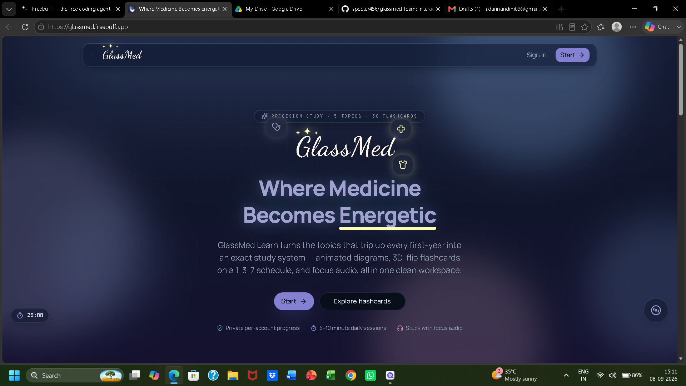
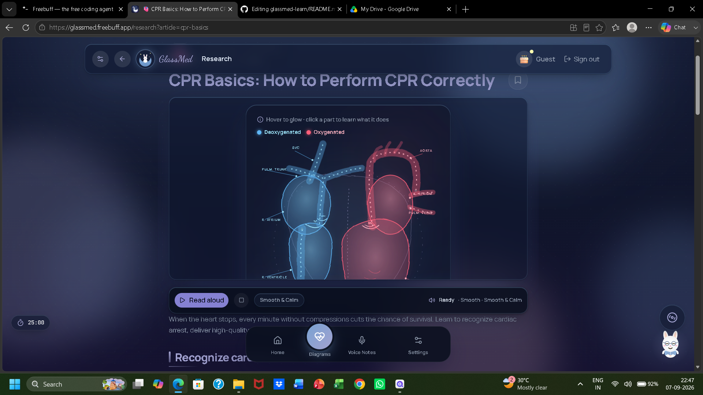
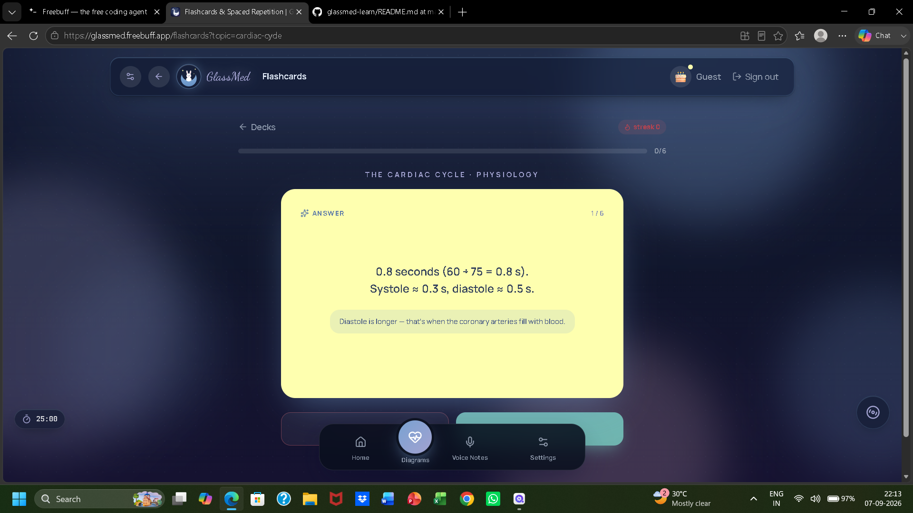

#  GlassMed: Where Medicine Becomes Energetic

**GlassMed** is an interactive, gamified medical education web app designed for first-year medical students and clinicians. It transforms dense medical textbooks into glowing "Heatwave" anatomy diagrams, spaced-repetition flashcards, clinical case games, and deep-dive research articles.

 **Live Demo:** https://glassmed.freebuff.app/

##  App Screenshots

##  Current Status
* **Working:** Interactive Heatwave Anatomy Gallery (Heart, Brain, Skeleton, etc.).
* **Working:** Spaced Repetition Flashcards with smart filtering.
* **Working:** First-Aid Simulator Game (Clinical scenarios).
* **Working:** Global Lo-Fi Music Player & Customizable Pomodoro Timer.
* ** In Progress:** Integrating a live AI API for the "Ask MediPro" chatbot.

##  Design Evolution & Thought Process
Building this app was an iterative journey of solving real user problems:
* **The Overwhelm Problem:** Initially, I built a long vertical list of medical topics. I realized this was overwhelming for students. **Solution:** I pivoted to a clean Grid Layout with a Search Bar and "Smart Shortcuts" (e.g., typing "CS" instantly pulls up Cardiac Surgery).
* **The Redundancy Problem:** I noticed my "Research" and "Basics" sections had overlapping content. **Solution:** I completely restructured the app. "Basics" is now strictly for student fundamentals, while "Research" was rebuilt as a professional clinical journal for doctors.
* **The Navigation Problem:** Users were getting lost in the deep content. **Solution:** I designed "Professor Rabbit," an interactive, spotlight-guided onboarding tour that teaches users how to use the app step-by-step.

##  Content Update Frequency
- Medical content is reviewed and updated **quarterly** (every 3 months)
- Guidelines are aligned with the latest editions of standard medical textbooks (Guyton, Ganong, Harper's)
- Clinical protocols follow current ACC/AHA, WHO, and Surviving Sepsis Campaign guidelines
- Last updated: September 2026
  
## Tech Stack
* **Frontend Framework:** React 19 & Vite (Chosen for fast, interactive UI rendering).
* **Styling & UI:** Tailwind CSS v4 & Shadcn UI (Used to build the custom glassmorphism and neon glowing effects).
* **Backend & Database:** Convex (Handles user authentication, flashcard data, and progress tracking).
* **Animations & 3D:** Framer Motion (for smooth page transitions) & Three.js (for 3D anatomy models).

##  Medical Review Board
This app's content is developed and reviewed by:
- **Medical Students** (First and second-year curriculum focus)
- **Standard References:** Content follows established medical education standards from:
  - Guyton & Hall Textbook of Medical Physiology
  - Ganong's Review of Medical Physiology
  - Harper's Illustrated Biochemistry
  - Gray's Anatomy for Students
  - Current clinical guidelines (ACC/AHA, WHO, Surviving Sepsis Campaign)

*Note: This is a student-led educational project. For clinical use, always refer to up-to-date peer-reviewed sources and institutional protocols.*

---

##  IMPORTANT MEDICAL DISCLAIMER

**GlassMed is an EDUCATIONAL TOOL ONLY and is NOT intended for clinical use.**

-  **DO NOT** use this app for actual patient care or clinical decision-making
-  **DO NOT** rely on this information for diagnosis or treatment
-  **ALWAYS** consult peer-reviewed medical literature and clinical guidelines
-  **ALWAYS** follow your institution's protocols and supervising physician's guidance
- This app is designed to **supplement** (not replace) formal medical education

**The developers assume no liability for any errors, omissions, or misuse of the information contained in this application. Medical knowledge evolves constantly - always verify information with current, authoritative sources.**

---

## ️ How It Works
* **Dual-Mode Learning:** Students learn the "Basics" (e.g., what is the cardiac cycle?), while clinicians read "In-Depth" research (e.g., STEMI door-to-balloon protocols).
* **Smart Shortcuts:** A custom parser allows users to type 2-letter codes to instantly jump to topics, preventing search bar clutter.
* **Gamification:** The "Tonight's Emergency Lineup" forces students to make life-or-death clinical decisions in a fun, low-stakes environment.

##  What I Learned
* **AI as a Tool, Not a Crutch:** I learned that AI can write syntax, but it cannot design a product. I acted as the Product Manager and UX Designer—debugging UI crashes, managing the AI's context limits, and forcing it to follow strict UX rules.
* **User-Centric Design:** Technology must fit the user's reality. Adding the "Read Aloud" feature and larger fonts wasn't in the original plan, but I realized medical students read for hours and needed to reduce eye strain.
* **Iterative Problem Solving:** When the AI kept breaking the navigation, I learned to break down complex features into smaller, isolated tasks to prevent the app from crashing.

##  Next Steps
* Integrate a real LLM API (like OpenAI) to make the "Ask MediPro" AI tutor fully functional.
* Add a backend database to sync user progress across multiple devices.
* Connect a custom domain (e.g., glassmed.app) for professional deployment.

##  Demo
https://drive.google.com/file/d/119zHp0h2-jTlyfOmFbAVaAVnpMVBqYZo/view?usp=sharing
